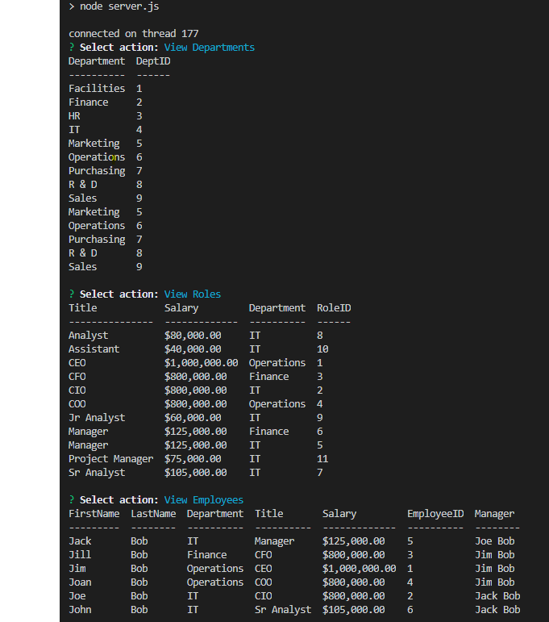

# Employee Tracker

  ## Description:
  This JavaScript program allows users to maintain a database of employees, roles, and departments.

  ## Links:
  * [Repo](https://github.com/locutusOO1/employee_tracker)
  * [Video Walkthrough](https://drive.google.com/file/d/14BWtv0EO2A6YhpcVEi04tcGsqzqfcXTr/view)

  ## Table of Contents:
  * [Installation](#installation)
  * [Usage](#usage)
  * [Technology Used](#technology-used)
  * [Questions](#questions)
  * [Screenshots](#screenshots)

  ## Installation:
  * Install dependencies by running "npm install" from the terminal.
  * Run "employee_tracker_db.sql" (located in the Assets folder) in a server instance of MySQL to create the table structure.
  * "employee_tracker_seed.sql" (located in the Assets folder) has been included to provide seed data if needed. This will also need to be run in a server instance of MySQL.
  
  ## Usage:
  * Run application from the terminal with "npm start"

  ## Technology Used:
  * Node.js - for JS runtime environment
  * JS/ES6+ - for program logic
  * MySQL - for DB functionality
  * Inquirer - for user input
  * console.table - for table output

  ## Questions:
  * Feel free to checkout my [GitHub Profile](https://github.com/locutusOO1).

  ## Screenshots:
  ### Table Views:

  
